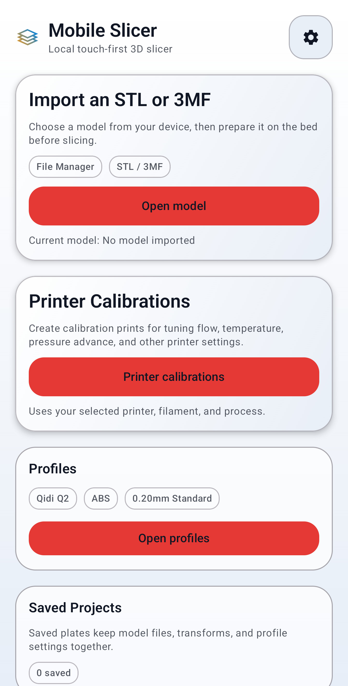
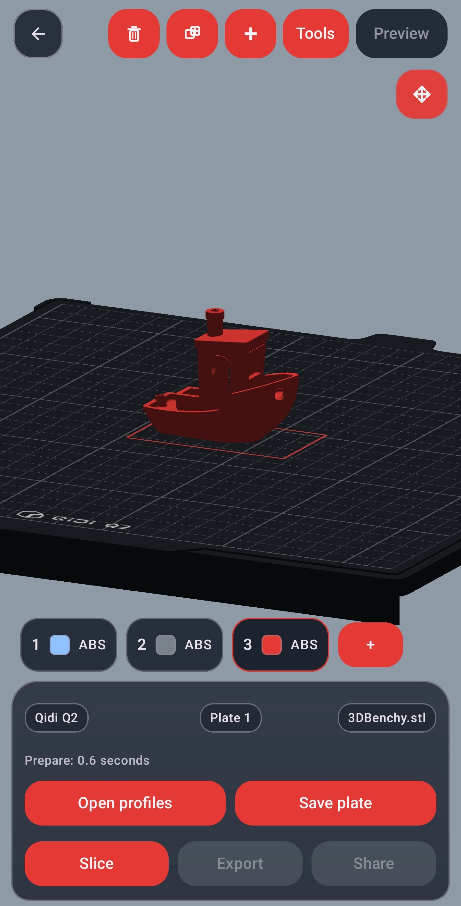
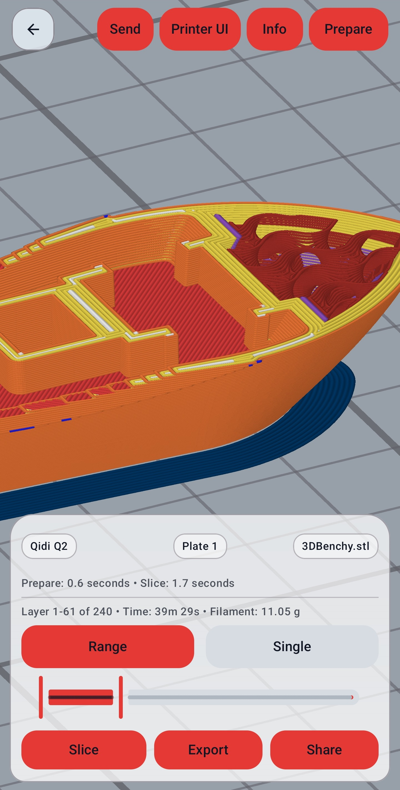
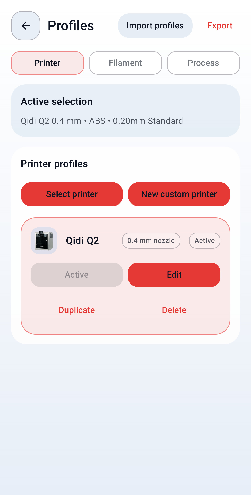
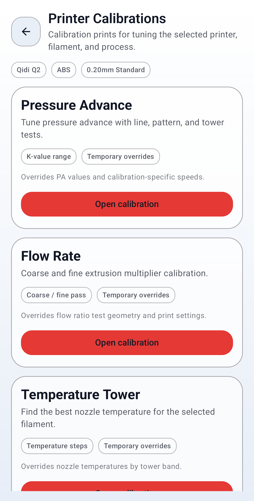

# MobileSlicer

[](https://github.com/MobileSlicerApp/MobileSlicer/actions/workflows/android-checks.yml)

MobileSlicer is a local, touch-first 3D slicer for Android.

It opens STL, 3MF, and STEP/STP files, prepares plates, slices on-device, previews G-code,
and exports or sends print files from a phone or tablet. The app is built for
Android with Kotlin, Jetpack Compose, and a native slicer engine derived from
OrcaSlicer and related open-source slicer work.

MobileSlicer is not affiliated with, endorsed by, or sponsored by the OrcaSlicer
project.

## Status

MobileSlicer beta builds are distributed through GitHub Releases. Download APKs
only from the official releases page:

<https://github.com/MobileSlicerApp/MobileSlicer/releases>

Current focus:

- STL, 3MF, and STEP/STP import from Android storage and share sheets
- Touch-first model workspace
- Printer, filament, and process profile selection
- Local slicing
- G-code preview
- Print-file export, sharing, and compatible network printer sending
- Saved plates and calibration flows

## Screenshots

<p>
  
  
  
  
  
</p>

## Build

Requirements:

- Android Studio or Android SDK command-line tools
- JDK 17
- Android SDK and NDK installed
- CMake available through the Android SDK

Set `ANDROID_HOME` or create `android-app/local.properties` with your local SDK
path:

```properties
sdk.dir=/path/to/Android/Sdk
```

Build the debug app:

```bash
cd android-app
./gradlew :app:assembleDebug
```

Release builds require local signing configuration that is intentionally not
tracked in git.

This repository includes vendored native slicer sources and generated profile
assets, so a checkout is larger than a typical Android-only app.

## Website and Support

- Website: <https://mobileslicer.com>
- Support email: <mobileslicerapp@gmail.com>
- Discord: <https://discord.gg/ckAAYAhRxE>

## Issues and Releases

Use GitHub issues for reproducible bugs, build problems, and printer
compatibility notes. See [CONTRIBUTING.md](CONTRIBUTING.md) before opening a
report.

GitHub Releases provide signed beta APKs and matching source snapshots. The
website links back to GitHub for downloads.

## License and Source

MobileSlicer release source is distributed under the GNU Affero General Public
License version 3. See [LICENSE](LICENSE), [SOURCE_NOTICE.md](SOURCE_NOTICE.md),
and [THIRD_PARTY_NOTICES.md](THIRD_PARTY_NOTICES.md).

Public source is hosted at <https://github.com/MobileSlicerApp/MobileSlicer>.
